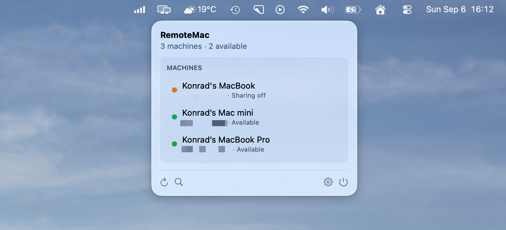
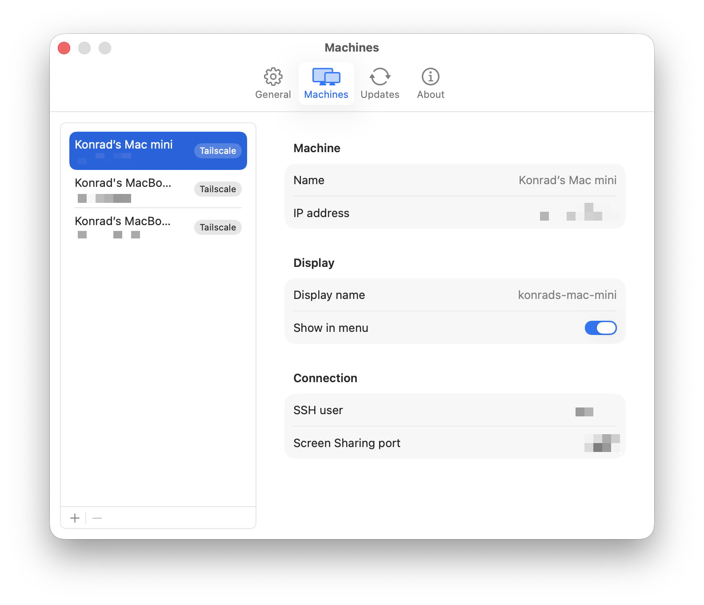

# RemoteMac

A macOS menu bar app that lists the Macs on your [Tailscale](https://tailscale.com)
tailnet by name instead of by IP, and gets you into them with one click — Screen
Sharing or an SSH session in your terminal of choice.

It replaces the ritual of opening Finder, hitting `⌘K`, and typing (or
remembering) an IP address. RemoteMac does not reimplement VNC or SSH — it
just points macOS's own Screen Sharing and your terminal at the right
address.

[](LICENSE)
[](#requirements)

## How it looks

**The menu bar panel** — your tailnet's Macs by name, with live status dots:



**Per-device settings** — override the display name, SSH user, and Screen
Sharing port for any device, or add machines manually:



**Quick connect** — a Spotlight-style window for finding and connecting to a
machine without touching the mouse:


## Features

- **Automatic Tailscale discovery** — every Mac on your tailnet shows up by
  name, no configuration required.
- **Manual hosts** — add machines that aren't on your tailnet by name and
  address.
- **Per-device settings** — SSH user, display name, Screen Sharing port, and
  show/hide, all overridable per machine.
- **Status at a glance** — a dot per device: available, sharing off, offline,
  or not found.
- **One-click Screen Sharing** — opens macOS's built-in Screen Sharing app.
- **SSH in your terminal** — Ghostty, iTerm2, Terminal, or Warp; only the
  ones actually installed on your Mac show up as options.
- **Copy IP / open SMB** — quick actions for when you need the raw address or
  a Finder connection instead.
- **Quick connect** — a Spotlight-style window to search and connect without
  touching the menu.
- **Background refresh** — statuses update every 30 seconds, so the dots are
  current before you even open the menu.
- **English and Polish**, following your Mac's language or a manual override.
- **Launch at login.**

## Requirements

- macOS 15 or newer
- [Tailscale](https://tailscale.com) (App Store or standalone build — either
  works)
- Screen Sharing enabled on the Macs you want to reach (System Settings →
  General → Sharing → Remote Management or Screen Sharing)

## Install

```bash
brew install --cask radnok/tap/remote-mac
```

Or grab the `.zip` from
[Releases](https://github.com/radnok/remote-mac/releases) and drag
`RemoteMac.app` into `/Applications`.

The app is signed with a Developer ID certificate and, once notarization is
set up, will be notarized by Apple, so it opens without a Gatekeeper warning.
See [Releases](#releasing) below for the current state of that pipeline.

## Build from source

You'll need a Swift 6 toolchain (ships with recent Xcode). There's no Xcode
project — it's a Swift package.

```bash
swift test              # run the test suite (165 tests)
./Scripts/build-app.sh  # build, assemble, and sign the .app
open ~/Applications/RemoteMac.app
```

`Scripts/build-app.sh` builds a release binary, assembles the `.app` bundle,
embeds `Sparkle.framework` for auto-updates, and signs everything with a
Developer ID certificate (Team `7S3F9767BM`) found in your keychain.

## Configuration

Settings are stored as plain, pretty-printed JSON at:

```
~/Library/Application Support/io.eightlines.remotemac/settings.json
```

It's meant to be hand-editable — there's no proprietary format or binary
plist involved. Passwords are never stored there or anywhere else in the app;
Screen Sharing keeps its own credentials in the macOS keychain.

## Honest caveats

- **An open Screen Sharing port means the service is listening, not that
  login will succeed.** RemoteMac only checks TCP reachability — it cannot
  and does not verify credentials.
- **Warp can't be driven programmatically.** Its automation API refuses to
  submit commands, so for Warp, RemoteMac opens the app and copies the SSH
  command to your clipboard for you to paste.
- **Terminal.app needs an Automation permission the first time** you use it
  from RemoteMac (macOS will prompt for it). Ghostty and iTerm2 don't require
  any extra permission.

## Releasing

This section is for maintainers.

```bash
./Scripts/release.sh <version>
```

builds, signs, notarizes (via a `notarytool` keychain profile — see the
script for setup instructions if you don't have one yet), staples the ticket,
re-packages, runs a Gatekeeper check, and generates the signed Sparkle
appcast. Tagging `vX.Y.Z` and pushing runs the same flow in
[`.github/workflows/release.yml`](.github/workflows/release.yml).

Auto-updates are powered by [Sparkle](https://sparkle-project.org). The
appcast is served from GitHub Pages
(`https://radnok.github.io/remote-mac/appcast.xml`) rather than as a release
asset, so update checks don't depend on any specific release being tagged
"latest."

### First-time setup

**This has not been done yet** — until it is, the app builds and runs fine
but update checks will fail against a URL that does not resolve.

1. **Notarization credentials** (once per machine). Create an
   app-specific password at <https://appleid.apple.com>, then:

   ```bash
   xcrun notarytool store-credentials remotemac-notary \
     --apple-id <your-apple-id> --team-id 7S3F9767BM
   ```

2. **A git remote**, and a `gh-pages` branch with GitHub Pages enabled for
   it. The first `release.sh` run writes `dist/appcast/appcast.xml`; publish
   that file at the repository root of `gh-pages` so it lands at the
   `SUFeedURL` above.

3. **The Sparkle signing key** already exists in the login keychain under
   the account `io.eightlines.remotemac`; its public half is in
   `Info.plist` as `SUPublicEDKey`. To release from CI instead of locally,
   export the private key with `~/.local/sparkle/bin/generate_keys -x` and
   store it as a repository secret.

## License

[MIT](LICENSE) © Konrad Alfaro
